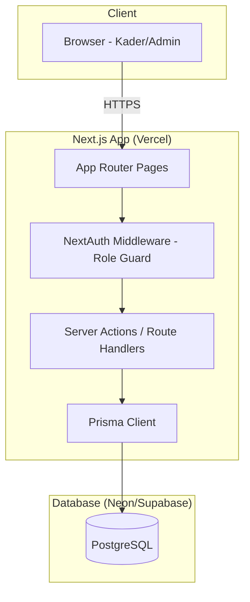
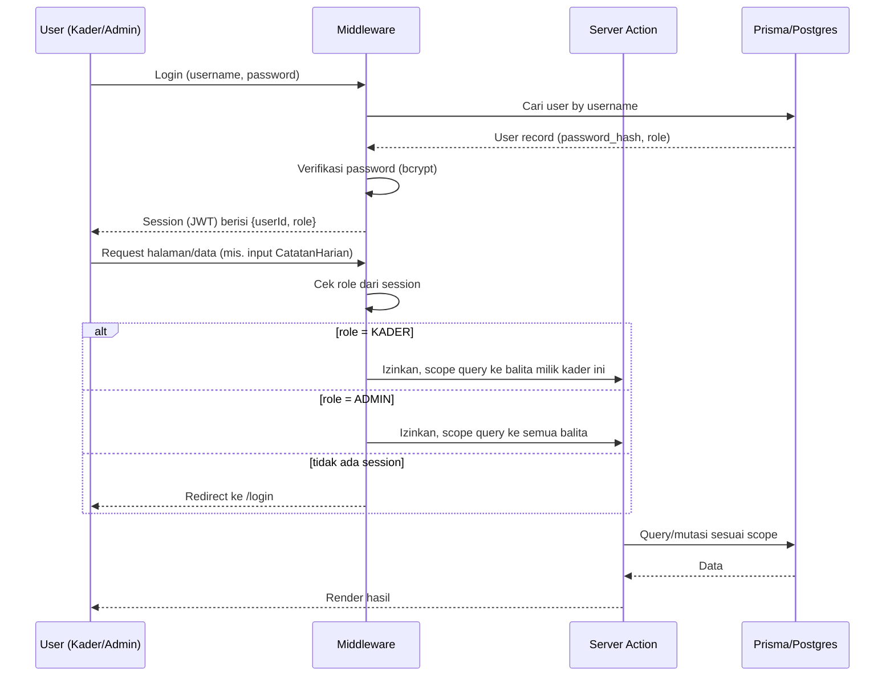
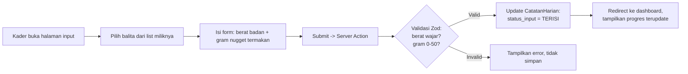

# Architecture — Sistem Monitoring Intervensi Gizi Balita

## 1. Tech Stack

| Layer | Pilihan | Alasan |
|---|---|---|
| Framework | **Next.js 14+ (App Router)** | Fullstack dalam satu codebase, Server Actions untuk mutasi data, cocok untuk deploy cepat ke Vercel |
| Bahasa | TypeScript | Type-safety untuk data model yang cukup kompleks (role, enum status) |
| ORM | **Prisma** | Type-safe query, migration management mudah, cocok dengan schema di `schema.md` |
| Database | **PostgreSQL** | Relasional, cocok untuk data terstruktur dengan constraint unik (mis. satu balita satu catatan per hari) |
| Auth | **NextAuth.js (Credentials Provider)** atau **Lucia Auth** | Role-based session (ADMIN/KADER), tidak perlu OAuth eksternal karena akun dibuat manual oleh admin |
| UI | **Tailwind CSS + shadcn/ui** | Cepat membangun form input & dashboard, komponen chart-friendly |
| Chart | **Recharts** | Native React, ringan, cocok untuk grafik tren BB harian per balita |
| Export | **exceljs** atau **SheetJS (xlsx)** | Export data ke Excel/CSV untuk analisis SPSS |
| Deployment | **Vercel** (app) + **Neon/Supabase** (Postgres hosted gratis) | Gratis untuk kebutuhan skripsi, setup minimal |

## 2. System Architecture



## 3. Auth & Authorization Flow



**Prinsip scoping:** setiap query yang dilakukan Kader **selalu difilter** `WHERE kaderId = session.userId`
di level Server Action — bukan hanya disembunyikan di UI. Ini penting agar Kader A tidak bisa
mengakses data balita Kader B walau tahu URL/ID-nya langsung (defense in depth).

## 4. Folder Structure

```
project/
├── prisma/
│   ├── schema.prisma
│   └── seed.ts                     # seed 40 balita + 4 kader + 1 admin (dummy/awal)
├── src/
│   ├── app/
│   │   ├── (auth)/
│   │   │   └── login/
│   │   │       └── page.tsx
│   │   ├── (admin)/
│   │   │   ├── dashboard/
│   │   │   │   └── page.tsx        # agregat 40 balita
│   │   │   ├── balita/
│   │   │   │   ├── page.tsx        # list & CRUD balita
│   │   │   │   └── [id]/page.tsx   # detail progres balita
│   │   │   ├── kader/
│   │   │   │   └── page.tsx        # kelola akun kader
│   │   │   └── export/
│   │   │       └── page.tsx        # export Excel/CSV
│   │   ├── (kader)/
│   │   │   ├── dashboard/
│   │   │   │   └── page.tsx        # list 10 balita miliknya
│   │   │   └── balita/
│   │   │       └── [id]/
│   │   │           ├── page.tsx        # detail + grafik tren
│   │   │           └── input/page.tsx  # form input harian
│   │   └── api/
│   │       └── auth/[...nextauth]/route.ts
│   ├── actions/                    # Server Actions
│   │   ├── balita.actions.ts
│   │   ├── catatan-harian.actions.ts
│   │   ├── hasil-lab.actions.ts
│   │   └── export.actions.ts
│   ├── lib/
│   │   ├── prisma.ts
│   │   ├── auth.ts                 # NextAuth config
│   │   └── validators/             # Zod schema per entity
│   │       ├── balita.schema.ts
│   │       ├── catatan-harian.schema.ts
│   │       └── hasil-lab.schema.ts
│   ├── components/
│   │   ├── ui/                     # shadcn components
│   │   ├── charts/
│   │   │   └── berat-badan-chart.tsx
│   │   └── forms/
│   │       ├── input-harian-form.tsx
│   │       └── hasil-lab-form.tsx
│   └── middleware.ts                # role guard
├── .env                              # DATABASE_URL, NEXTAUTH_SECRET
└── package.json
```

## 5. Data Flow: Input Harian oleh Kader



## 6. Deployment

1. **Database**: provision PostgreSQL gratis di Neon atau Supabase, ambil `DATABASE_URL`.
2. **Migration**: `npx prisma migrate deploy` saat pertama deploy.
3. **Seed awal**: jalankan `seed.ts` untuk buat 1 akun Admin + 4 akun Kader (password di-generate,
   dikirim manual ke masing-masing kader).
4. **App**: push ke GitHub → connect ke Vercel → set environment variables (`DATABASE_URL`,
   `NEXTAUTH_SECRET`, `NEXTAUTH_URL`).
5. **Domain**: pakai domain default Vercel (`*.vercel.app`) — cukup untuk kebutuhan sidang &
   pemakaian kader di lapangan.

## 7. Non-Functional Considerations

- **Mobile-friendly**: kader kemungkinan input dari HP di lapangan → wajib responsive (Tailwind
  mobile-first).
- **Offline resilience**: di luar scope v1, tapi kalau sinyal di lapangan buruk, pertimbangkan
  optimistic UI / retry submit sebagai future enhancement.
- **Backup data**: karena ini data penelitian, aktifkan automatic backup dari provider Postgres
  (Neon/Supabase punya point-in-time recovery di free tier terbatas — pertimbangkan export
  manual berkala sebagai mitigasi).
