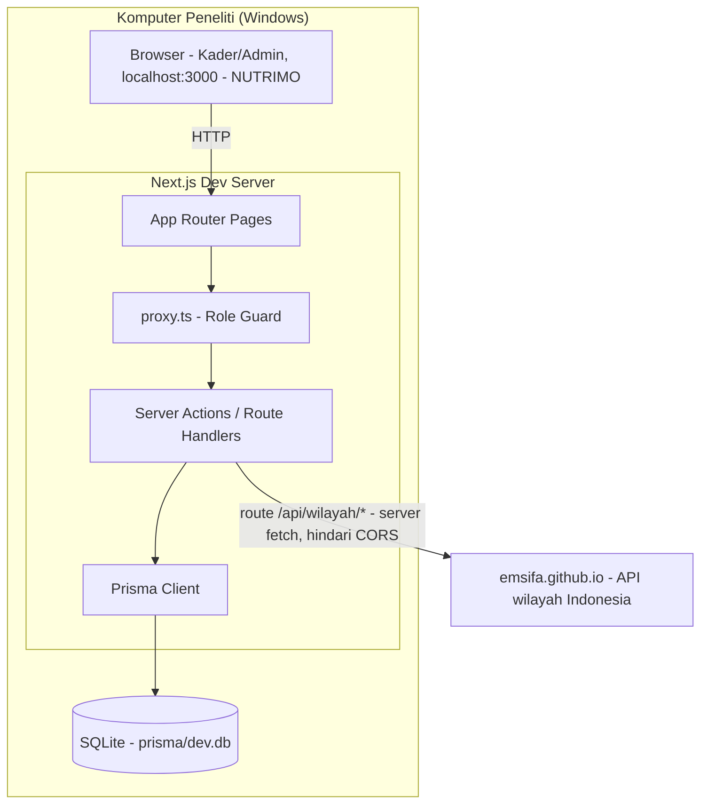
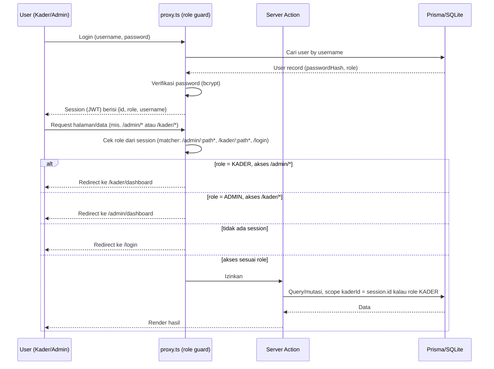
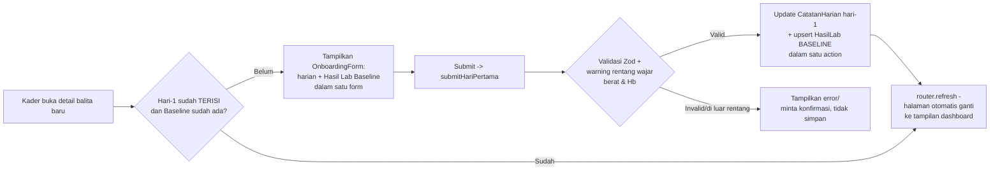
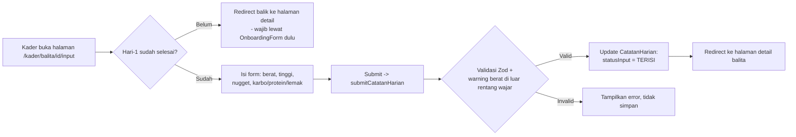
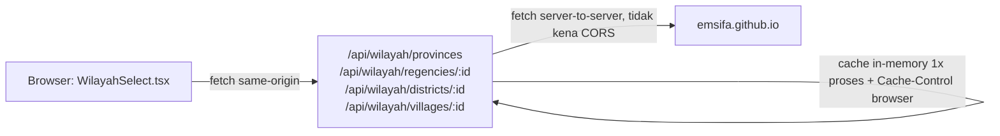

# Architecture — NUTRIMO (Nuget Nutrition Monitoring)

> **Update:** stack & struktur folder di sini mengikuti implementasi aktual di
> `D:\projek\balitaFeed`, sudah berbeda dari rencana awal (lihat catatan di tiap bagian). Nama
> aplikasi yang ditampilkan ke user sekarang **NUTRIMO** — nama folder/package proyek
> (`balita-feed`) tidak diganti, ini murni rebrand tampilan (title tab, sidebar, halaman login).

## 1. Tech Stack (aktual)

| Layer | Pilihan | Perubahan dari rencana awal |
|---|---|---|
| Framework | **Next.js 16.3.4 (App Router)** | Rencana awal "14+"; Next 16 punya breaking change: `middleware.ts` → `proxy.ts`, `params`/`searchParams` jadi `Promise` (async) |
| Bahasa | TypeScript 5 | tidak berubah |
| ORM | **Prisma 6.19.3** (pinned exact, bukan `^`) | Prisma 7 mengubah cara baca `url` datasource (butuh `prisma.config.ts` + driver adapter) — sengaja **tidak** dipakai supaya setup tetap simpel |
| Database | **SQLite lokal** (`prisma/dev.db`) | Rencana awal Postgres (Neon/Supabase). Diganti ke SQLite lokal untuk kebutuhan skripsi (tanpa provisioning cloud DB, jalan penuh di laptop). Konsekuensi: semua `enum` di schema.md jadi `String` yang divalidasi Zod, bukan Prisma enum native |
| Auth | **NextAuth v5 (beta) — Credentials Provider** | Sesuai rencana; session JWT, role (`ADMIN`/`KADER`) disisipkan di token |
| UI | **Tailwind CSS v4** (tanpa shadcn/ui) | Rencana awal shadcn/ui — diganti komponen UI custom ringan (`src/components/ui.tsx`: `Button`, `Input`, `Select`, `Card`, `Badge`, dst.) supaya dependency lebih sedikit |
| Chart | **Recharts** | Sesuai rencana — `TrendChart` generic component untuk tren BB & TB |
| Validasi | **Zod v4** | Ditambahkan (belum eksplisit di rencana awal) — skema di `src/lib/validators.ts` |
| Export | **PapaParse** (CSV) | Rencana awal exceljs/SheetJS — diganti CSV polos (PapaParse) karena SPSS/Excel bisa baca CSV langsung, lebih ringan |
| Data wilayah | **emsifa/api-wilayah-indonesia** (proxy server-side) | Fitur baru, tidak ada di rencana awal — lihat §7 |
| Deployment | **Belum dideploy** — jalan lokal (`npm run dev`) di komputer peneliti | Rencana awal Vercel + Neon/Supabase; untuk kebutuhan skripsi saat ini cukup lokal. Kalau nanti deploy, lihat catatan migrasi di §8 |

## 2. System Architecture (aktual — jalan lokal)



## 3. Auth & Authorization Flow



**Prinsip scoping (tidak berubah, defense in depth):** setiap Server Action untuk role Kader
selalu memfilter berdasarkan `kaderId = session.user.id` di level query — bukan hanya
disembunyikan di UI. Ini dicek eksplisit misalnya di `getScopedBalitaOrThrow` (`catatan-harian.actions.ts`)
dan di `submitHasilLab`/`submitHariPertama`.

**Label UI "SPV Kader":** role `ADMIN` di database & di URL (`/admin/*`) tidak diganti — hanya
teks yang ditampilkan ke user (mis. judul halaman, pesan error `requireAdmin()`) yang memakai
label "SPV Kader" alih-alih "Admin".

**Nama aplikasi "NUTRIMO":** diterapkan di 3 tempat tampilan — `<title>` tab browser
(`src/app/layout.tsx`), sidebar/header `AppShell` (`src/components/AppShell.tsx`), dan halaman
login (`src/app/login/page.tsx`). Tidak mengubah struktur folder, nama package (`package.json`
`name` tetap `balita-feed`), atau URL apapun.

## 4. Folder Structure (aktual)

```
balita-feed/                          # nama folder/package tidak diganti (lihat catatan di atas)
├── prisma/
│   ├── schema.prisma
│   └── seed.ts                      # seed kosong: 1 admin + 4 kader, TANPA balita/catatan
│                                     # dummy — supaya kader bisa dites dari kondisi awal asli
├── src/
│   ├── app/
│   │   ├── login/page.tsx           # "NUTRIMO"
│   │   ├── admin/                   # folder biasa (BUKAN route group (admin) — lihat catatan)
│   │   │   ├── layout.tsx
│   │   │   ├── dashboard/page.tsx   # agregat semua balita
│   │   │   ├── balita/
│   │   │   │   ├── page.tsx         # list & tambah balita
│   │   │   │   └── [id]/page.tsx    # detail + form input (admin)
│   │   │   ├── kader/page.tsx       # kelola akun kader (add/update/delete)
│   │   │   └── export/page.tsx      # export CSV
│   │   ├── kader/                   # folder biasa (BUKAN route group (kader))
│   │   │   ├── layout.tsx
│   │   │   ├── dashboard/page.tsx   # list balita miliknya
│   │   │   └── balita/[id]/
│   │   │       ├── page.tsx         # detail + onboarding form (hari-1) / dashboard
│   │   │       └── input/page.tsx   # input harian (hari ke-2 dst.)
│   │   └── api/
│   │       ├── auth/[...nextauth]/route.ts
│   │       ├── export/
│   │       │   ├── harian/route.ts
│   │       │   └── ringkasan/route.ts
│   │       └── wilayah/             # proxy server-side ke emsifa (hindari CORS) — lihat §7
│   │           ├── provinces/route.ts
│   │           ├── regencies/[provinceId]/route.ts
│   │           ├── districts/[regencyId]/route.ts
│   │           └── villages/[districtId]/route.ts
│   ├── actions/                     # Server Actions
│   │   ├── auth.actions.ts
│   │   ├── balita.actions.ts        # createBalita, updateBalitaStatus, deleteBalita,
│   │   │                             # createKader, updateKader, deleteKader
│   │   ├── catatan-harian.actions.ts
│   │   ├── hasil-lab.actions.ts     # kunci hari per tipe lab (lihat rule.md §7)
│   │   ├── onboarding.actions.ts    # submitHariPertama — gabung harian + Baseline
│   │   └── signout.action.ts
│   ├── lib/
│   │   ├── prisma.ts
│   │   ├── constants.ts             # ROLES, TIPE_LAB, HARI_LAB, LABEL_LAB, dll.
│   │   ├── validators.ts            # semua Zod schema
│   │   ├── data.ts                  # isSameDay, todayCatatan
│   │   ├── utils.ts                 # formatTanggal, complianceRate, delta, cn
│   │   ├── wilayah.ts               # client fetch ke /api/wilayah/*
│   │   └── wilayah-server.ts        # server fetch ke emsifa + cache
│   ├── components/
│   │   ├── ui.tsx                   # Button, Input, Select, Card, Badge, Label, dst.
│   │   ├── AppShell.tsx             # bottom nav (mobile) / sidebar (desktop) — "NUTRIMO"
│   │   ├── BalitaForm.tsx           # form Tambah Balita (identitas+kontak+wilayah+riwayat)
│   │   ├── BalitaStatusForm.tsx
│   │   ├── CatatanHarianForm.tsx    # input harian (hari ke-2 dst.)
│   │   ├── OnboardingForm.tsx       # input hari-1 gabungan (harian + Baseline)
│   │   ├── HasilLabForm.tsx         # 1 tipe lab per render (dikunci ke hari yg sesuai)
│   │   ├── KaderForm.tsx / KaderRow.tsx / KaderEditForm.tsx / KaderDeleteButton.tsx
│   │   ├── WilayahSelect.tsx        # dropdown berjenjang Prov→Kab/Kota→Kec→Desa
│   │   ├── TrendChart.tsx
│   │   ├── LoginForm.tsx
│   │   └── icons.tsx
│   ├── proxy.ts                     # role guard (dulu middleware.ts di Next <16)
│   └── types/next-auth.d.ts         # augmentasi type session.user (id, role, username)
├── .env                              # DATABASE_URL, NEXTAUTH_SECRET
├── .gitignore
└── package.json                      # "name": "nutrimo" (cosmetic, tidak wajib reinstall)
```

> **Kenapa bukan route group `(admin)`/`(kader)`:** rencana awal pakai route group
> `(admin)/balita/[id]/page.tsx` dan `(kader)/balita/[id]/page.tsx` — tapi route group **tidak
> muncul di URL**, jadi dua-duanya resolve ke URL yang sama (`/balita/[id]`) dan bentrok. Sudah
> diganti jadi folder biasa `admin/` dan `kader/` sehingga URL-nya beda (`/admin/balita/[id]` vs
> `/kader/balita/[id]`).

## 5. Data Flow: Input Hari Ke-1 (Onboarding) — kader



## 6. Data Flow: Input Harian (Hari ke-2 dst.) — kader



## 7. Fitur Baru: Dropdown Wilayah Administratif (berjenjang)

Form Tambah Balita punya dropdown Provinsi → Kab/Kota → Kecamatan → Desa/Kel yang saling
mengunci (pilih level di atas dulu, baru level bawahnya terisi). Sumber data: API statis publik
[`emsifa/api-wilayah-indonesia`](https://github.com/emsifa/api-wilayah-indonesia) (hosted di
GitHub Pages).

**Kendala & solusi:** GitHub Pages tidak mengirim header `Access-Control-Allow-Origin`, jadi
fetch **langsung dari browser** ke `emsifa.github.io` diblokir CORS. Solusinya: browser fetch ke
route internal `/api/wilayah/**` (`src/app/api/wilayah/`), yang lalu fetch ke emsifa **dari sisi
server** (`src/lib/wilayah-server.ts`) — server-to-server tidak kena aturan CORS.



Server juga men-cache hasil di memori proses (tidak pernah kadaluwarsa selama server hidup —
data wilayah administratif praktis tidak berubah) dan mengirim `Cache-Control` supaya browser
ikut cache. Ada timeout 6 detik: kalau emsifa lambat/tidak respons, `WilayahSelect` otomatis
fallback ke isian teks manual supaya form tidak macet.

## 8. Migrasi ke Production (kalau nanti perlu deploy, saat ini di luar scope)

1. **Database**: provision PostgreSQL (Neon/Supabase), ganti `datasource db { provider = "sqlite" }`
   jadi `"postgresql"`, dan field `String` yang sebelumnya mewakili enum bisa (opsional) diganti
   balik jadi `enum` Prisma asli.
2. **Migration**: `npx prisma migrate deploy` (bukan `db push` yang sekarang dipakai untuk SQLite lokal).
3. **App**: push ke GitHub → connect Vercel → set env vars (`DATABASE_URL`, `NEXTAUTH_SECRET`, `NEXTAUTH_URL`).
4. Tidak perlu ubah apapun terkait fetch wilayah — proxy server-side (`/api/wilayah/**`) tetap
   berfungsi sama di production.

## 9. Non-Functional Considerations

- **Mobile-first**: `AppShell` pakai bottom nav di mobile (`md:hidden`), sidebar di desktop
  (`hidden md:flex`) — sesuai permintaan awal "utamakan tampilan mobile, bertahap sampai desktop".
- **Offline resilience**: masih di luar scope untuk data harian/lab. Untuk dropdown wilayah,
  sudah ada fallback manual kalau koneksi ke emsifa gagal (lihat §7).
- **Backup data**: karena SQLite lokal (`prisma/dev.db`), backup = copy file itu secara berkala —
  belum ada mekanisme otomatis.