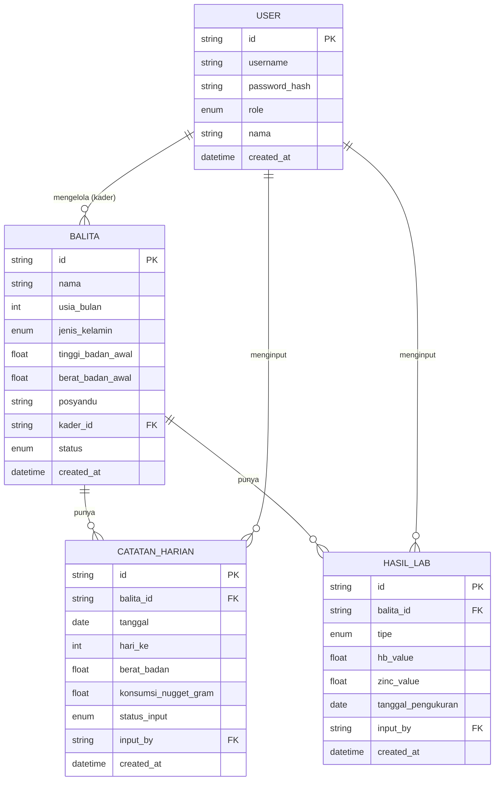

# Schema — Sistem Monitoring Intervensi Gizi Balita

## 1. Entity Relationship Diagram



## 2. Tabel: `User`

Menyimpan akun Admin & Kader. Tidak ada self-registration — akun dibuat oleh Admin.

| Field | Tipe | Constraint | Keterangan |
|---|---|---|---|
| `id` | string (cuid/uuid) | PK | |
| `username` | string | unique, not null | Login identifier, mis. `kader1` |
| `password_hash` | string | not null | Hash pakai bcrypt/argon2 |
| `role` | enum(`ADMIN`, `KADER`) | not null | Menentukan scope akses |
| `nama` | string | not null | Nama lengkap kader/peneliti |
| `created_at` | datetime | default now | |

## 3. Tabel: `Balita`

Profil baseline balita, di-assign ke satu kader.

| Field | Tipe | Constraint | Keterangan |
|---|---|---|---|
| `id` | string | PK | |
| `nama` | string | not null | |
| `usia_bulan` | int | not null | Usia saat registrasi (bulan) |
| `jenis_kelamin` | enum(`L`, `P`) | not null | |
| `tinggi_badan_awal` | float | not null | cm |
| `berat_badan_awal` | float | not null | kg — dipakai sebagai baseline delta |
| `posyandu` | string | not null | Asal posyandu/wilayah |
| `kader_id` | string | FK → `User.id`, not null | Kader penanggung jawab |
| `status` | enum(`AKTIF`, `SELESAI`, `DROPOUT`) | default `AKTIF` | |
| `created_at` | datetime | default now | |

**Index:** `kader_id` (untuk query cepat "balita milik kader X").

## 4. Tabel: `CatatanHarian`

Satu baris = satu hari monitoring untuk satu balita (idealnya 28 baris per balita).

| Field | Tipe | Constraint | Keterangan |
|---|---|---|---|
| `id` | string | PK | |
| `balita_id` | string | FK → `Balita.id`, not null | |
| `tanggal` | date | not null | |
| `hari_ke` | int | not null, 1–28 | Hari ke-berapa dari mulai studi |
| `berat_badan` | float, nullable | | kg. Null jika `status_input = TIDAK_TERISI` |
| `konsumsi_nugget_gram` | float, nullable | | Target 50gr (2 biji × 25gr). Null jika tidak terisi |
| `status_input` | enum(`TERISI`, `TIDAK_TERISI`) | not null, default `TIDAK_TERISI` | Untuk compliance rate |
| `input_by` | string, nullable | FK → `User.id` | Kader yang menginput |
| `created_at` | datetime | default now | |

**Unique constraint:** (`balita_id`, `hari_ke`) — satu balita hanya boleh punya satu catatan per hari.

**Index:** `balita_id`, `tanggal`.

> Catatan desain: baris `CatatanHarian` untuk semua 28 hari **di-generate di awal** (saat balita
> didaftarkan / studi dimulai) dengan `status_input = TIDAK_TERISI`, lalu di-update oleh kader
> saat mereka input. Ini memudahkan hitung compliance rate (`COUNT(status_input = TERISI) / 28`)
> tanpa perlu logic tambahan untuk deteksi "hari yang terlewat".

## 5. Tabel: `HasilLab`

Hasil Hb & Zinc — hanya 2 baris per balita (baseline & endline).

| Field | Tipe | Constraint | Keterangan |
|---|---|---|---|
| `id` | string | PK | |
| `balita_id` | string | FK → `Balita.id`, not null | |
| `tipe` | enum(`BASELINE`, `ENDLINE`) | not null | Hari-0 atau hari-28 |
| `hb_value` | float | not null | g/dL |
| `zinc_value` | float | not null | µg/dL (sesuaikan satuan dgn lab) |
| `tanggal_pengukuran` | date | not null | |
| `input_by` | string | FK → `User.id` | |
| `created_at` | datetime | default now | |

**Unique constraint:** (`balita_id`, `tipe`) — satu balita hanya boleh punya satu `BASELINE` dan satu `ENDLINE`.

## 6. Derived / Computed Values (tidak disimpan di DB, dihitung on-the-fly)

- **Delta berat badan** = `berat_badan` terakhir (hari-28) − `berat_badan_awal`
- **Delta Hb** = `HasilLab(ENDLINE).hb_value` − `HasilLab(BASELINE).hb_value`
- **Delta Zinc** = `HasilLab(ENDLINE).zinc_value` − `HasilLab(BASELINE).zinc_value`
- **Compliance rate** (per balita) = `COUNT(CatatanHarian WHERE status_input=TERISI) / 28 × 100%`
- **Rata-rata konsumsi harian** = `AVG(konsumsi_nugget_gram)` dari baris yang terisi

## 7. Prisma Schema (referensi implementasi)

```prisma
enum Role {
  ADMIN
  KADER
}

enum JenisKelamin {
  L
  P
}

enum StatusBalita {
  AKTIF
  SELESAI
  DROPOUT
}

enum StatusInput {
  TERISI
  TIDAK_TERISI
}

enum TipeLab {
  BASELINE
  ENDLINE
}

model User {
  id           String   @id @default(cuid())
  username     String   @unique
  passwordHash String
  role         Role
  nama         String
  createdAt    DateTime @default(now())

  balita         Balita[]         @relation("KaderBalita")
  catatanHarian  CatatanHarian[]  @relation("InputCatatan")
  hasilLab       HasilLab[]       @relation("InputLab")
}

model Balita {
  id               String       @id @default(cuid())
  nama             String
  usiaBulan        Int
  jenisKelamin     JenisKelamin
  tinggiBadanAwal  Float
  beratBadanAwal   Float
  posyandu         String
  kaderId          String
  status           StatusBalita @default(AKTIF)
  createdAt        DateTime     @default(now())

  kader          User            @relation("KaderBalita", fields: [kaderId], references: [id])
  catatanHarian  CatatanHarian[]
  hasilLab       HasilLab[]

  @@index([kaderId])
}

model CatatanHarian {
  id                   String      @id @default(cuid())
  balitaId             String
  tanggal              DateTime
  hariKe               Int
  beratBadan           Float?
  konsumsiNuggetGram   Float?
  statusInput          StatusInput @default(TIDAK_TERISI)
  inputBy              String?
  createdAt            DateTime    @default(now())

  balita  Balita @relation(fields: [balitaId], references: [id])
  input   User?  @relation("InputCatatan", fields: [inputBy], references: [id])

  @@unique([balitaId, hariKe])
  @@index([balitaId])
  @@index([tanggal])
}

model HasilLab {
  id                 String   @id @default(cuid())
  balitaId           String
  tipe               TipeLab
  hbValue            Float
  zincValue          Float
  tanggalPengukuran  DateTime
  inputBy            String?
  createdAt          DateTime @default(now())

  balita  Balita @relation(fields: [balitaId], references: [id])
  input   User?  @relation("InputLab", fields: [inputBy], references: [id])

  @@unique([balitaId, tipe])
}
```
