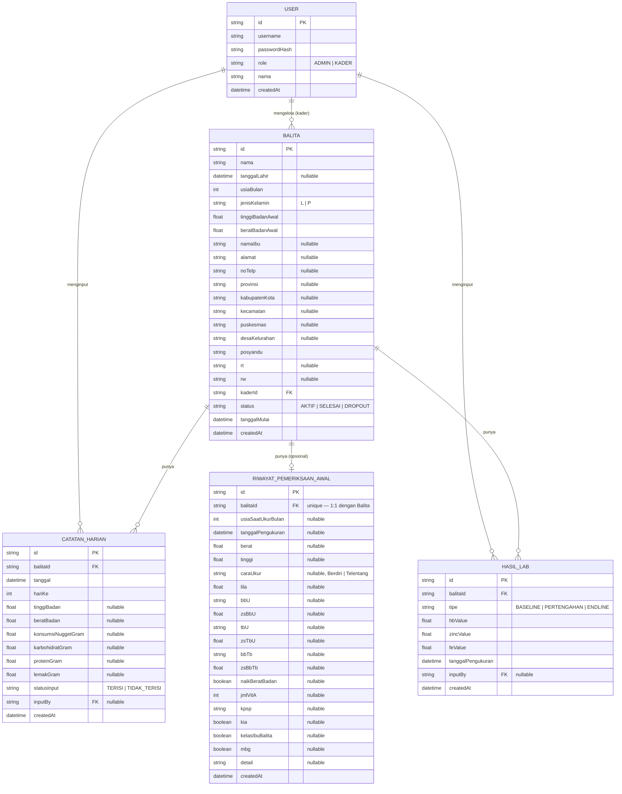

# Schema — NUTRIMO (Nuget Nutrition Monitoring)

> **Update:** dokumen ini mengikuti implementasi aktual (`prisma/schema.prisma`), bukan lagi
> rencana awal. Perbedaan terbesar dari draft v1: database SQLite lokal (bukan Postgres) sehingga
> semua `enum` diimplementasikan sebagai `String` yang divalidasi di `src/lib/validators.ts`;
> ada tabel baru `RiwayatPemeriksaanAwal`; `Balita` punya banyak field identitas/kontak/wilayah
> tambahan; `CatatanHarian` menambah `tinggiBadan` + 3 makronutrien; `HasilLab` menambah `feValue`
> dan tipe ketiga `PERTENGAHAN`. Proyek ini sekarang bernama **NUTRIMO** (rebrand tampilan saja —
> nama tabel/model di skema tidak berubah).

## 1. Entity Relationship Diagram



## 2. Tabel: `User`

Menyimpan akun Admin & Kader. Tidak ada self-registration — akun dibuat oleh Admin. Di UI, role
`ADMIN` ditampilkan dengan label **"SPV Kader"** (label saja — nilai di database & URL `/admin/*`
tetap `ADMIN`, tidak ada perubahan skema untuk ini).

| Field | Tipe | Constraint | Keterangan |
|---|---|---|---|
| `id` | string (cuid) | PK | |
| `username` | string | unique, not null | Login identifier, mis. `kader1` |
| `passwordHash` | string | not null | Hash bcrypt |
| `role` | string (`ADMIN`, `KADER`) | not null | Divalidasi via `ROLES` di `constants.ts`, bukan Prisma enum (SQLite tidak dukung) |
| `nama` | string | not null | Nama lengkap kader/peneliti |
| `createdAt` | datetime | default now | |

Admin bisa **Tambah**, **Update**, dan **Hapus** akun kader (update ditambahkan setelah v1 —
sebelumnya hanya add/delete).

## 3. Tabel: `Balita`

Profil balita, di-assign ke satu kader. Jauh lebih lengkap dari draft awal — field identitas,
kontak, dan wilayah administratif ditambahkan supaya data setara dengan catatan posyandu manual.

| Field | Tipe | Constraint | Keterangan |
|---|---|---|---|
| `id` | string | PK | |
| `nama` | string | not null | |
| `tanggalLahir` | datetime, nullable | | |
| `usiaBulan` | int | not null | Usia saat registrasi (bulan), 0–59 |
| `jenisKelamin` | string (`L`, `P`) | not null | |
| `tinggiBadanAwal` | float | not null | cm — baseline delta |
| `beratBadanAwal` | float | not null | kg — baseline delta |
| `namaIbu` | string, nullable | | Nama ibu kandung |
| `alamat` | string, nullable | | |
| `noTelp` | string, nullable | | |
| `provinsi` | string, nullable | | Dipilih via dropdown wilayah (lihat `architecture.md` §7) |
| `kabupatenKota` | string, nullable | | |
| `kecamatan` | string, nullable | | |
| `puskesmas` | string, nullable | | Isian teks manual (bukan dari API wilayah) |
| `desaKelurahan` | string, nullable | | |
| `posyandu` | string | not null | Isian teks manual |
| `rt` | string, nullable | | |
| `rw` | string, nullable | | |
| `kaderId` | string | FK → `User.id`, not null | Kader penanggung jawab |
| `status` | string (`AKTIF`, `SELESAI`, `DROPOUT`) | default `AKTIF` | |
| `tanggalMulai` | datetime | default now | Tanggal balita mulai ikut studi 28 hari — dasar hitung `hariKe` |
| `createdAt` | datetime | default now | |

**Index:** `kaderId`.

Semua field baru di atas (kecuali `nama`, `usiaBulan`, `jenisKelamin`, `tinggiBadanAwal`,
`beratBadanAwal`, `posyandu`, `kaderId`) **opsional** — form Tambah Balita tetap bisa disubmit
walau field-field ini dikosongkan.

## 4. Tabel: `RiwayatPemeriksaanAwal` (baru)

Snapshot **satu kali** data pemeriksaan posyandu terakhir **sebelum** balita ikut studi 28 hari
ini (bukan bagian dari studi — jangan disamakan dengan `HasilLab` tipe `BASELINE` atau
`CatatanHarian` hari ke-1). Diisi manual oleh Admin saat registrasi balita, lewat bagian
collapsible "Riwayat Pemeriksaan Sebelum Proyek Ini" di form Tambah Balita. Relasi 1:1 dengan
`Balita` — baris ini **hanya dibuat kalau minimal satu field-nya diisi**; kalau tidak ada sama
sekali yang diisi, tidak ada baris yang dibuat.

| Field | Tipe | Keterangan |
|---|---|---|
| `id` | string | PK |
| `balitaId` | string | FK → `Balita.id`, unique (1:1) |
| `usiaSaatUkurBulan` | int, nullable | |
| `tanggalPengukuran` | datetime, nullable | |
| `berat` | float, nullable | kg |
| `tinggi` | float, nullable | cm |
| `caraUkur` | string, nullable | `Berdiri` \| `Telentang` |
| `lila` | float, nullable | Lingkar Lengan Atas, cm |
| `bbU` | string, nullable | Kategori BB/U: `Gizi Buruk` \| `Gizi Kurang` \| `Gizi Baik` \| `Gizi Lebih` |
| `zsBbU` | float, nullable | Z-score BB/U |
| `tbU` | string, nullable | Kategori TB/U: `Sangat Pendek` \| `Pendek` \| `Normal` \| `Tinggi` |
| `zsTbU` | float, nullable | Z-score TB/U |
| `bbTb` | string, nullable | Kategori BB/TB (sama set nilai dengan BB/U) |
| `zsBbTb` | float, nullable | Z-score BB/TB |
| `naikBeratBadan` | boolean, nullable | |
| `jmlVitA` | int, nullable | Jumlah/dosis vitamin A yang sudah diterima |
| `kpsp` | string, nullable | Hasil KPSP: `Sesuai` \| `Meragukan` \| `Penyimpangan` |
| `kia` | boolean, nullable | Punya buku KIA |
| `kelasIbuBalita` | boolean, nullable | Pernah ikut Kelas Ibu Balita |
| `mbg` | boolean, nullable | Terdaftar program Makan Bergizi Gratis |
| `detail` | string, nullable | Catatan bebas |
| `createdAt` | datetime | default now |

> Set nilai kategori (`caraUkur`, `bbU`/`bbTb`, `tbU`, `kpsp`) adalah **asumsi** saat fitur ini
> dibuat — kalau istilah yang dipakai posyandu di lapangan berbeda, tinggal disesuaikan di
> `CARA_UKUR`/`KATEGORI_GIZI`/`KATEGORI_TB_U`/`HASIL_KPSP` (`src/lib/constants.ts`).

## 5. Tabel: `CatatanHarian`

Satu baris = satu hari monitoring untuk satu balita (28 baris per balita, di-generate otomatis).
Sekarang mencakup tinggi badan + 3 makronutrien harian, bukan cuma berat badan + nugget.

| Field | Tipe | Constraint | Keterangan |
|---|---|---|---|
| `id` | string | PK | |
| `balitaId` | string | FK → `Balita.id`, not null | |
| `tanggal` | datetime | not null | |
| `hariKe` | int | not null, 1–28 | Hari ke-berapa dari `tanggalMulai` balita |
| `tinggiBadan` | float, nullable | | cm. Null jika `statusInput = TIDAK_TERISI` |
| `beratBadan` | float, nullable | | kg |
| `konsumsiNuggetGram` | float, nullable | | Target 50gr (2 biji × 25gr) |
| `karbohidratGram` | float, nullable | | gram, asupan harian |
| `proteinGram` | float, nullable | | gram, asupan harian |
| `lemakGram` | float, nullable | | gram, asupan harian |
| `statusInput` | string (`TERISI`, `TIDAK_TERISI`) | not null, default `TIDAK_TERISI` | Untuk compliance rate |
| `inputBy` | string, nullable | FK → `User.id` | Kader yang menginput |
| `createdAt` | datetime | default now | |

**Unique constraint:** (`balitaId`, `hariKe`). **Index:** `balitaId`, `tanggal`.

> Catatan desain (tidak berubah dari v1): baris untuk semua 28 hari **di-generate di awal** saat
> balita didaftarkan, dengan `statusInput = TIDAK_TERISI`, lalu di-update oleh kader saat input.

## 6. Tabel: `HasilLab`

Hasil Hb, Zinc, **dan Fe** (zat besi) — **3 baris per balita**: Baseline, Pertengahan, Endline
(bukan 2 seperti draft awal — lihat `rule.md` §7 untuk aturan "kunci hari" per checkpoint).

| Field | Tipe | Constraint | Keterangan |
|---|---|---|---|
| `id` | string | PK | |
| `balitaId` | string | FK → `Balita.id`, not null | |
| `tipe` | string (`BASELINE`, `PERTENGAHAN`, `ENDLINE`) | not null | Hari-1, hari-14, hari-28 (lihat `HARI_LAB` di `constants.ts`) |
| `hbValue` | float | not null | g/dL |
| `zincValue` | float | not null | µg/dL |
| `feValue` | float | not null | µg/dL |
| `tanggalPengukuran` | datetime | not null | |
| `inputBy` | string, nullable | FK → `User.id` | |
| `createdAt` | datetime | default now | |

**Unique constraint:** (`balitaId`, `tipe`) — satu balita hanya boleh punya satu baris per tipe
(disimpan via `upsert`, bukan `create` — jadi "update" kalau tipe itu sudah ada).

## 7. Derived / Computed Values (tidak disimpan di DB, dihitung on-the-fly)

- **Delta berat/tinggi badan** = nilai terakhir yang terisi − nilai awal (`beratBadanAwal`/`tinggiBadanAwal`)
- **Delta Hb/Zinc/Fe** = `HasilLab(ENDLINE)` − `HasilLab(BASELINE)` (Pertengahan belum dipakai untuk delta di UI saat ini)
- **Compliance rate** (per balita) = `COUNT(CatatanHarian WHERE statusInput=TERISI) / 28 × 100%`
- **Rata-rata asupan harian** = `AVG(konsumsiNuggetGram | karbohidratGram | proteinGram | lemakGram)` dari baris yang terisi

## 8. Prisma Schema (aktual — `prisma/schema.prisma`)

```prisma
generator client {
  provider = "prisma-client-js"
}

datasource db {
  provider = "sqlite"
  url      = env("DATABASE_URL")
}

// Role: "ADMIN" | "KADER"
// JenisKelamin: "L" | "P"
// StatusBalita: "AKTIF" | "SELESAI" | "DROPOUT"
// StatusInput: "TERISI" | "TIDAK_TERISI"
// TipeLab: "BASELINE" | "PERTENGAHAN" | "ENDLINE"

model User {
  id           String   @id @default(cuid())
  username     String   @unique
  passwordHash String
  role         String
  nama         String
  createdAt    DateTime @default(now())

  balita        Balita[]        @relation("KaderBalita")
  catatanHarian CatatanHarian[] @relation("InputCatatan")
  hasilLab      HasilLab[]      @relation("InputLab")
}

model Balita {
  id              String    @id @default(cuid())
  nama            String
  tanggalLahir    DateTime?
  usiaBulan       Int
  jenisKelamin    String
  tinggiBadanAwal Float
  beratBadanAwal  Float

  namaIbu String?
  alamat  String?
  noTelp  String?

  provinsi      String?
  kabupatenKota String?
  kecamatan     String?
  puskesmas     String?
  desaKelurahan String?
  posyandu      String
  rt            String?
  rw            String?

  kaderId      String
  status       String   @default("AKTIF")
  tanggalMulai DateTime @default(now())
  createdAt    DateTime @default(now())

  kader                  User                    @relation("KaderBalita", fields: [kaderId], references: [id])
  catatanHarian          CatatanHarian[]
  hasilLab               HasilLab[]
  riwayatPemeriksaanAwal RiwayatPemeriksaanAwal?

  @@index([kaderId])
}

model RiwayatPemeriksaanAwal {
  id       String @id @default(cuid())
  balitaId String @unique

  usiaSaatUkurBulan Int?
  tanggalPengukuran DateTime?
  berat             Float?
  tinggi            Float?
  caraUkur          String?
  lila              Float?
  bbU               String?
  zsBbU             Float?
  tbU               String?
  zsTbU             Float?
  bbTb              String?
  zsBbTb            Float?
  naikBeratBadan    Boolean?
  jmlVitA           Int?
  kpsp              String?
  kia               Boolean?
  kelasIbuBalita    Boolean?
  mbg               Boolean?
  detail            String?

  createdAt DateTime @default(now())

  balita Balita @relation(fields: [balitaId], references: [id], onDelete: Cascade)
}

model CatatanHarian {
  id                 String   @id @default(cuid())
  balitaId           String
  tanggal            DateTime
  hariKe             Int
  tinggiBadan        Float?
  beratBadan         Float?
  konsumsiNuggetGram Float?
  karbohidratGram    Float?
  proteinGram        Float?
  lemakGram          Float?
  statusInput        String   @default("TIDAK_TERISI")
  inputBy            String?
  createdAt          DateTime @default(now())

  balita Balita @relation(fields: [balitaId], references: [id], onDelete: Cascade)
  input  User?  @relation("InputCatatan", fields: [inputBy], references: [id])

  @@unique([balitaId, hariKe])
  @@index([balitaId])
  @@index([tanggal])
}

model HasilLab {
  id                String   @id @default(cuid())
  balitaId          String
  tipe              String
  hbValue           Float
  zincValue         Float
  feValue           Float
  tanggalPengukuran DateTime
  inputBy           String?
  createdAt         DateTime @default(now())

  balita Balita @relation(fields: [balitaId], references: [id], onDelete: Cascade)
  input  User?  @relation("InputLab", fields: [inputBy], references: [id])

  @@unique([balitaId, tipe])
}
```